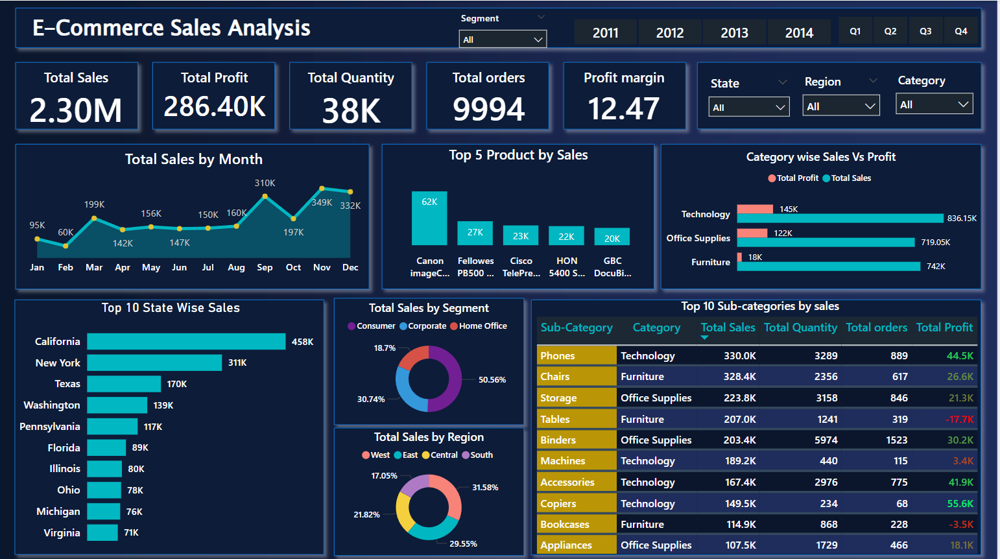

# E-Commerce Sales Analysis

This project analyzes e-commerce sales and finance performance. The goal is to identify sales trends, profit drivers, and regional performance using Excel and Power BI.

# Table Of Contents
 
1. Project Overview 
2. Business Problem  
3. Dataset  
4. Tools and Technologies  
5. Project Structure  
6. Key Findings  
7. Dashboard  
8. How to Run this Project  
9. Final Recommendations  
10. Author & Contact  

# Project Overview

The dashboard provides insights into sales and financial performance across years, categories, and regions. It includes year-over-year comparisons, sales trends, and profitability analysis. A Complete data pipeline was built using Excel and Power BI for analysis .

# Business Problem 

The company needs to track and analyze sales and profit trends over multiple years to:  
- Identify growth opportunities.  
- Compare sales vs profit across categories and regions.  
- Understand year-over-year performance to support decision-making.

# Dataset

- Files : E commerce_sales_Data.xlsx
- Data Includes : Row ID , Order ID , Order Date , Year , Ship Date, Ship Mode , Customer ID , Customer Name , Segment , Country , City ,	State , Postal Code , Region , Product ID , Category , Sub-Category , Product Name , Sales , Quantity , Discount

# Tools & Technologies

- **Excel**: Data cleaning and preparation  
- **Power BI**: Data visualization and dashboard building 

# Project Structure

E-commerce-Sales-Analysis/
│
├── Data/
│ └── E commerce_sales_Data.xlsx # dataset used for analysis
│
├── Dashboard/
│ └── E commerce_sales Dashboard.pbix # Power BI dashboard file
│
├── Reports/
│ ├── E commerce_sales_Report.pdf # Final project report
│ └── Screenshot.png # Dashboard screenshot for quick view
│
└── README.md # Project documentation

# Data Cleaning and preparation

1. **Removed Duplicates** – Ensured no duplicate sales records were present.  
3. **Data Type Correction** – Converted columns like Order Date into proper Date format, Sales/Profit into numeric type.  
4. **Created New Columns** –  
   - Extracted *Year, Month, Quarter* from Order Date for time-based analysis. 
   - Added *Profit* Columns in Excel. 
   - Added *Profit Margin %* measures in Power BI.

# Key Findings 

-  In 2014, both **sales and profit showed strong growth** compared to previous years.  
- In 2012, **sales were lower**, but **profit margins were higher relative to sales**, indicating better cost efficiency.  
- In the **South region**, sales contribution was **highest in 2011**compared to following years, but gradually declined in the following years.  
- The **Technology** and **Office Supplies** categories contributed the most to total sales.    
- Some regions with high sales volumes still show **low profitability**, highlighting operational inefficiencies. 

# Dashboard

- Power BI Dashboard Shows:
      - Sales by Month
      - Category Wise Sales and profit
      - Sales by region 
      - Sales by Segment

# How to Run This Project

1. Download this repository.  
2. Open `E commerce_sales.xlsx` in Excel to explore raw data.  
3. Open `E commerce_sales Dashboard.pbix` in Power BI Desktop.  
4. Refresh the dataset if required.  
5. Interact with the dashboard for insights. 

# Final Recommendations

- Focus on improving sales in the South region, since sales share has been declining after 2011.

- Continue strategies that boosted overall sales and profit growth in 2014, and replicate them in other regions.

- Identify why 2012 showed lower sales but relatively higher profit margin. This indicates cost efficiency that can be applied in future years.

- Strengthen top-performing categories and regions, while designing targeted campaigns for weaker areas.

- Maintain regular monitoring of sales and profit trends through the dashboard for better decision-making.

# Author & Contact 

Rita Nayak

Aspiring Data Analyst

Email: ritanayak6087@gmail.com

Linkedin: https://www.linkedin.com/in/rita-nayak-74a055378/

